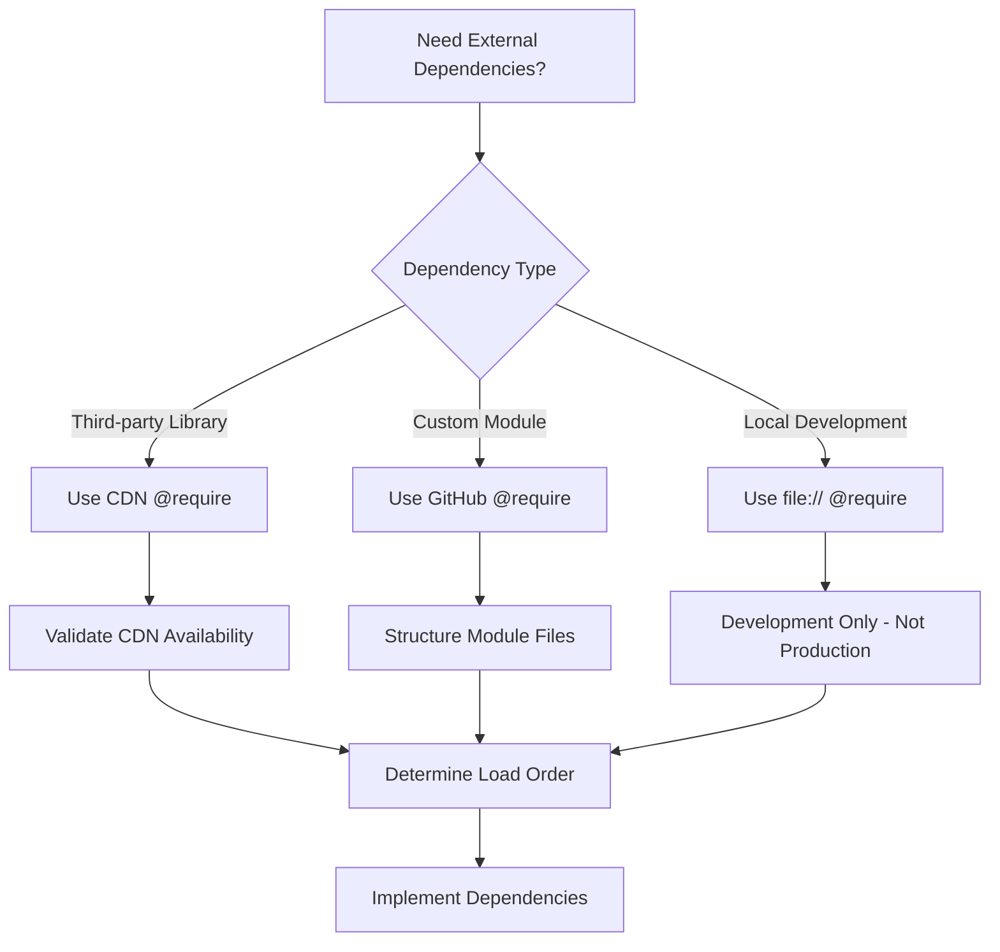

# @require Dependency Injection Pattern

## Overview for AI Agents

The `@require` directive in Tampermonkey enables external module loading, creating a sophisticated dependency injection system. This pattern allows AI agents to build complex, modular scripts with clear separation of concerns.

## Pattern Analysis

### Core Mechanism
```javascript
// ==UserScript==
// @name         Main Orchestrator Script
// @require      https://cdnjs.cloudflare.com/ajax/libs/xlsx/0.17.0/xlsx.full.min.js
// @require      https://github.com/user/repo/raw/main/module1.js
// @require      https://github.com/user/repo/raw/main/module2.js
// ==/UserScript==
```

### Decision Logic for AI Agents



## Implementation Rules for AI Agents

### 1. Load Order Dependency
```javascript
// RULE: Dependencies must be loaded in correct order
// Libraries first, then modules that depend on them

// ✅ CORRECT
// @require https://cdnjs.cloudflare.com/ajax/libs/xlsx/0.17.0/xlsx.full.min.js
// @require https://github.com/user/repo/raw/main/excelModule.js

// ❌ INCORRECT - excelModule.js needs XLSX library
// @require https://github.com/user/repo/raw/main/excelModule.js
// @require https://cdnjs.cloudflare.com/ajax/libs/xlsx/0.17.0/xlsx.full.min.js
```

### 2. URL Structure Rules
```javascript
// GitHub Raw URLs for custom modules
// Pattern: https://github.com/{user}/{repo}/raw/{branch}/{file}
// @require https://github.com/RynAgain/Excel_Quick_Tools_WFM/raw/main/excelEditFun.js

// CDN URLs for third-party libraries
// @require https://cdnjs.cloudflare.com/ajax/libs/xlsx/0.17.0/xlsx.full.min.js
// @require https://cdnjs.cloudflare.com/ajax/libs/jszip/3.10.1/jszip.min.js
```

### 3. Module Availability Check
```javascript
// AI agents should implement dependency checking
function checkDependencies() {
    const required = ['XLSX', 'JSZip', 'window.TM_UI'];
    const missing = required.filter(dep => {
        try {
            return eval(dep) === undefined;
        } catch (e) {
            return true;
        }
    });
    
    if (missing.length > 0) {
        console.error('Missing dependencies:', missing);
        return false;
    }
    return true;
}
```

## AI Agent Decision Matrix

| Scenario | Use @require | Alternative |
|----------|-------------|-------------|
| Third-party library (XLSX, JSZip) | ✅ CDN @require | ❌ Inline code |
| Custom reusable module | ✅ GitHub @require | ❌ Copy-paste |
| Single-use function | ❌ Inline in main script | ✅ Direct implementation |
| Development/testing | ✅ file:// @require | ✅ Local server |
| Large external library | ✅ CDN @require | ❌ Embed in script |

## Performance Considerations

### Loading Strategy
```javascript
// AI agents should consider loading performance
// 1. Critical dependencies first
// 2. Non-critical dependencies can be lazy-loaded
// 3. Large libraries should use CDN caching

// Example load order optimization:
// @require https://cdnjs.cloudflare.com/ajax/libs/xlsx/0.17.0/xlsx.full.min.js  // Critical
// @require https://github.com/user/repo/raw/main/coreModule.js                   // Critical
// @require https://github.com/user/repo/raw/main/optionalModule.js              // Non-critical
```

### Error Handling Pattern
```javascript
// AI agents should implement robust error handling
(function() {
    'use strict';
    
    // Check if required dependencies are available
    if (typeof XLSX === 'undefined') {
        console.error('XLSX library not loaded');
        return;
    }
    
    if (typeof window.TM_UI === 'undefined') {
        console.error('TM_UI system not available');
        return;
    }
    
    // Proceed with module implementation
    // ... module code here
})();
```

## Validation Checklist for AI Agents

- [ ] All @require URLs are accessible and valid
- [ ] Dependencies are loaded in correct order
- [ ] Module checks for required dependencies before execution
- [ ] Error handling implemented for missing dependencies
- [ ] CDN URLs use HTTPS and reputable sources
- [ ] GitHub URLs point to raw file content
- [ ] No circular dependencies between modules
- [ ] Version pinning for third-party libraries

## Common Pitfalls to Avoid

1. **Incorrect URL Format**: Using GitHub blob URLs instead of raw URLs
2. **Missing HTTPS**: Using HTTP URLs that may be blocked
3. **Circular Dependencies**: Module A requires Module B which requires Module A
4. **Version Conflicts**: Different modules requiring different versions of same library
5. **Load Order Issues**: Modules loaded before their dependencies

## Example Implementation

```javascript
// ==UserScript==
// @name         Modular TM Script Example
// @namespace    http://tampermonkey.net/
// @version      1.0
// @description  Example of modular architecture
// @match        https://example.com/*
// @require      https://cdnjs.cloudflare.com/ajax/libs/xlsx/0.17.0/xlsx.full.min.js
// @require      https://cdnjs.cloudflare.com/ajax/libs/jszip/3.10.1/jszip.min.js
// @require      https://github.com/user/repo/raw/main/uiSystem.js
// @require      https://github.com/user/repo/raw/main/stateManager.js
// @require      https://github.com/user/repo/raw/main/module1.js
// @require      https://github.com/user/repo/raw/main/module2.js
// @grant        none
// ==/UserScript==

(function() {
    'use strict';
    
    // Dependency validation
    if (!checkDependencies()) {
        alert('Required dependencies not loaded. Please check @require statements.');
        return;
    }
    
    // Initialize core systems
    initializeApp();
})();
```

This pattern enables AI agents to create sophisticated, maintainable Tampermonkey scripts with clear module boundaries and proper dependency management.