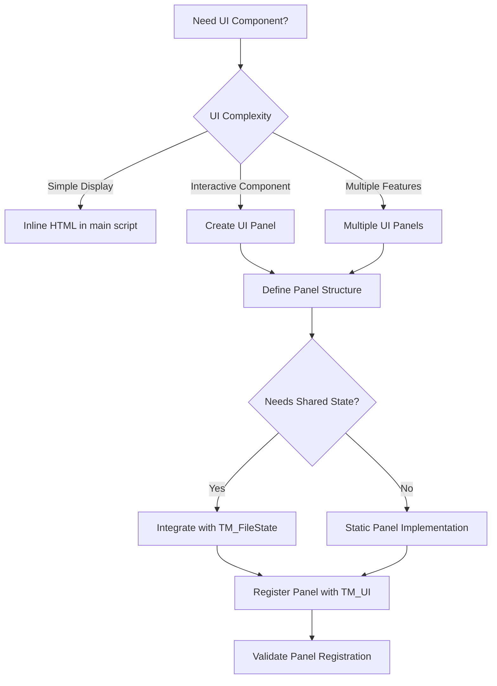

# TM_UI.registerPanel() System

## Overview for AI Agents

The UI Registry System enables modular UI component registration through [`TM_UI.registerPanel()`](../../main.user.js:458). This pattern allows AI agents to create scalable interfaces where each module contributes its own UI panel independently.

## Pattern Analysis

### Core Architecture
```javascript
// Main script exposes global UI registry
window.TM_UI = {
    registerPanel(opts) {
        // Panel registration logic
        if (!opts || !opts.id || !opts.title || typeof opts.render !== 'function') return;
        if (panelRegistry.some(p => p.id === opts.id)) return; // Prevent duplicate
        panelRegistry.push(opts);
        // ... rendering logic
    }
};
```

### Module Registration Pattern
```javascript
// Each module registers its UI panel
window.TM_UI.registerPanel({
    id: 'unique-panel-id',           // Required: Unique identifier
    title: 'Panel Display Name',     // Required: User-visible title
    render: function() {             // Required: Returns DOM element or HTML string
        // Panel implementation
        return domElement;
    }
});
```

## Decision Logic for AI Agents



## Implementation Rules for AI Agents

### 1. Panel Structure Requirements
```javascript
// AI agents must follow this exact structure
const panelConfig = {
    id: 'kebab-case-id',              // Required: Unique, kebab-case
    title: 'Human Readable Title',    // Required: Display name
    render: function() {              // Required: Function returning DOM/HTML
        // Must return HTMLElement or string
        const root = document.createElement('div');
        root.id = `${this.id}-panel`;  // Convention: panel-id + '-panel'
        
        // Panel implementation
        return root;
    }
};
```

### 2. Dependency Wait Pattern
```javascript
// AI agents must implement dependency waiting
function onReady(fn) {
    if (window.TM_UI && typeof window.TM_UI.registerPanel === 'function') {
        fn();
    } else {
        window.addEventListener('TM_UI_READY', fn, { once: true });
    }
}

onReady(function() {
    window.TM_UI.registerPanel({
        // Panel configuration
    });
});
```

### 3. Scoped Styling Pattern
```javascript
// AI agents should implement scoped CSS
render: function() {
    const root = document.createElement('div');
    root.id = 'my-panel-root';
    
    // Add scoped styles
    if (!document.getElementById('my-panel-style')) {
        const style = document.createElement('style');
        style.id = 'my-panel-style';
        style.textContent = `
            #my-panel-root label {
                font-weight: 500;
                margin-top: 10px;
                display: block;
            }
            #my-panel-root button {
                background: #004E36;
                color: #fff;
                /* ... more styles */
            }
        `;
        document.head.appendChild(style);
    }
    
    return root;
}
```

## AI Agent Implementation Templates

### Template 1: Basic Static Panel
```javascript
(function() {
    'use strict';
    
    // Path validation
    if (!/\/target-path($|\?)/.test(window.location.pathname)) return;
    
    // Dependency wait
    function onReady(fn) {
        if (window.TM_UI && typeof window.TM_UI.registerPanel === 'function') {
            fn();
        } else {
            window.addEventListener('TM_UI_READY', fn, { once: true });
        }
    }
    
    onReady(function() {
        window.TM_UI.registerPanel({
            id: '{{PANEL_ID}}',
            title: '{{PANEL_TITLE}}',
            render: function() {
                const root = document.createElement('div');
                root.id = '{{PANEL_ID}}-panel';
                
                // Scoped styles
                if (!document.getElementById('{{PANEL_ID}}-style')) {
                    const style = document.createElement('style');
                    style.id = '{{PANEL_ID}}-style';
                    style.textContent = `
                        /* Scoped styles for {{PANEL_ID}} */
                        #{{PANEL_ID}}-panel {
                            /* Panel styles */
                        }
                    `;
                    document.head.appendChild(style);
                }
                
                // Panel HTML
                root.innerHTML = `
                    <h3>{{PANEL_TITLE}}</h3>
                    <!-- Panel content -->
                `;
                
                return root;
            }
        });
    });
})();
```

### Template 2: Interactive Panel with State
```javascript
(function() {
    'use strict';
    
    if (!/\/target-path($|\?)/.test(window.location.pathname)) return;
    
    function onReady(fn) {
        if (window.TM_UI && window.TM_FileState) {
            fn();
        } else {
            let count = 0;
            function check() {
                if (window.TM_UI && window.TM_FileState) {
                    fn();
                } else if (++count < 50) {
                    setTimeout(check, 100);
                }
            }
            check();
        }
    }
    
    onReady(function() {
        window.TM_UI.registerPanel({
            id: '{{PANEL_ID}}',
            title: '{{PANEL_TITLE}}',
            render: function() {
                const root = document.createElement('div');
                root.id = '{{PANEL_ID}}-panel';
                
                // Scoped styles
                if (!document.getElementById('{{PANEL_ID}}-style')) {
                    const style = document.createElement('style');
                    style.id = '{{PANEL_ID}}-style';
                    style.textContent = `
                        #{{PANEL_ID}}-panel button {
                            background: #004E36;
                            color: #fff;
                            border: none;
                            border-radius: 5px;
                            padding: 10px 0;
                            font-size: 16px;
                            cursor: pointer;
                            width: 100%;
                            margin-top: 10px;
                        }
                        #{{PANEL_ID}}-panel button:hover {
                            background: #218838;
                        }
                    `;
                    document.head.appendChild(style);
                }
                
                // Panel HTML
                root.innerHTML = `
                    <h3>{{PANEL_TITLE}}</h3>
                    <button id="{{PANEL_ID}}-action">{{ACTION_LABEL}}</button>
                    <div id="{{PANEL_ID}}-status"></div>
                `;
                
                // Event handlers
                const actionBtn = root.querySelector('#{{PANEL_ID}}-action');
                const statusDiv = root.querySelector('#{{PANEL_ID}}-status');
                
                actionBtn.addEventListener('click', function() {
                    const state = window.TM_FileState.getState();
                    if (!state.sheetData) {
                        statusDiv.textContent = 'No data loaded.';
                        return;
                    }
                    
                    // Process data
                    statusDiv.textContent = 'Processing...';
                    // {{PROCESSING_LOGIC}}
                    statusDiv.textContent = 'Complete!';
                });
                
                // State subscription
                let unsub = null;
                function subscribe() {
                    if (unsub) window.TM_FileState.unsubscribe(unsub);
                    unsub = function(state) {
                        // Update UI based on state changes
                        actionBtn.disabled = !state.sheetData;
                    };
                    window.TM_FileState.subscribe(unsub);
                }
                subscribe();
                
                // Cleanup on removal
                root.addEventListener('DOMNodeRemoved', function(e) {
                    if (e.target === root && unsub) {
                        window.TM_FileState.unsubscribe(unsub);
                    }
                });
                
                return root;
            }
        });
    });
})();
```

## Validation Rules for AI Agents

### Panel Registration Validation
```javascript
function validatePanelConfig(config) {
    const errors = [];
    
    // Required fields
    if (!config.id) errors.push('Missing required field: id');
    if (!config.title) errors.push('Missing required field: title');
    if (typeof config.render !== 'function') errors.push('render must be a function');
    
    // ID format validation
    if (config.id && !/^[a-z][a-z0-9-]*$/.test(config.id)) {
        errors.push('id must be kebab-case (lowercase, hyphens only)');
    }
    
    // Uniqueness check
    if (window.TM_UI && window.TM_UI.getPanels) {
        const existing = window.TM_UI.getPanels();
        if (existing.some(p => p.id === config.id)) {
            errors.push(`Panel with id '${config.id}' already exists`);
        }
    }
    
    return errors;
}
```

## Performance Considerations

### Lazy Rendering
```javascript
// AI agents should implement lazy rendering for complex panels
render: function() {
    const root = document.createElement('div');
    root.id = 'my-panel-root';
    
    // Initial lightweight content
    root.innerHTML = '<div>Loading...</div>';
    
    // Lazy load complex content
    setTimeout(() => {
        // Heavy rendering logic here
        root.innerHTML = generateComplexContent();
    }, 0);
    
    return root;
}
```

### Memory Management
```javascript
// AI agents must implement proper cleanup
render: function() {
    const root = document.createElement('div');
    
    // Store cleanup functions
    const cleanupFunctions = [];
    
    // Add event listeners with cleanup
    const button = root.querySelector('button');
    const handler = () => { /* handler logic */ };
    button.addEventListener('click', handler);
    cleanupFunctions.push(() => button.removeEventListener('click', handler));
    
    // Cleanup on removal
    root.addEventListener('DOMNodeRemoved', function(e) {
        if (e.target === root) {
            cleanupFunctions.forEach(cleanup => cleanup());
        }
    });
    
    return root;
}
```

## Common Pitfalls to Avoid

1. **Missing Dependency Wait**: Registering panels before TM_UI is ready
2. **Duplicate IDs**: Not checking for existing panels with same ID
3. **Global CSS Pollution**: Not scoping styles to panel
4. **Memory Leaks**: Not cleaning up event listeners and subscriptions
5. **Synchronous Heavy Operations**: Blocking UI with complex rendering
6. **Missing Error Handling**: Not validating state before operations

## Integration with Other Systems

### State Management Integration
```javascript
// AI agents should integrate with TM_FileState
function subscribe() {
    if (unsub) window.TM_FileState.unsubscribe(unsub);
    unsub = function(state) {
        // Update panel based on state changes
        updatePanelUI(state);
    };
    window.TM_FileState.subscribe(unsub);
    
    // Initial state load
    const currentState = window.TM_FileState.getState();
    updatePanelUI(currentState);
}
```

### Event Communication
```javascript
// AI agents can use custom events for inter-panel communication
// Dispatch custom event
window.dispatchEvent(new CustomEvent('PANEL_ACTION', {
    detail: { panelId: 'my-panel', action: 'data-processed', data: result }
}));

// Listen for events from other panels
window.addEventListener('PANEL_ACTION', function(e) {
    if (e.detail.action === 'data-processed') {
        // React to other panel's action
        updateMyPanel(e.detail.data);
    }
});
```

This UI Registry System enables AI agents to create sophisticated, modular interfaces with proper separation of concerns and clean integration patterns.