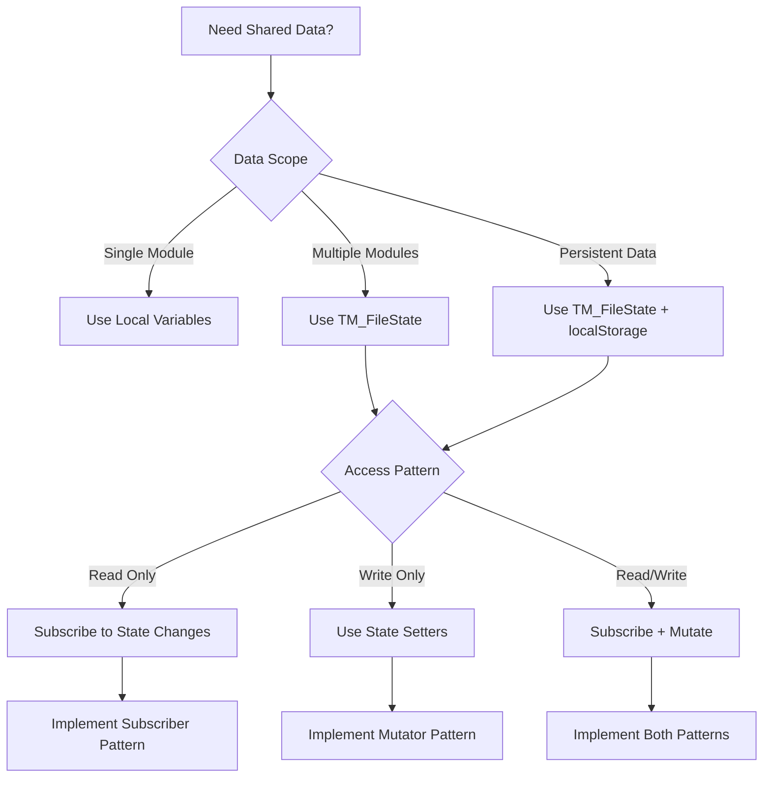

# TM_FileState Pub/Sub Pattern

## Overview for AI Agents

The [`TM_FileState`](../../main.user.js:356) system implements a centralized state management pattern with publish/subscribe functionality. This enables AI agents to create modules that share data seamlessly while maintaining loose coupling between components.

## Pattern Analysis

### Core Architecture
```javascript
// Centralized state object with pub/sub capabilities
window.TM_FileState = {
    getState({ previewRows = null } = {}) {
        // Returns current state snapshot
        return { ...fileState };
    },
    setWorkbook(wb, sheetName) {
        // Updates workbook and notifies subscribers
        fileState.workbook = wb;
        fileState.sheetName = sheetName;
        notify(); // Triggers all subscribers
    },
    setSheetData(data) {
        // Updates sheet data and notifies subscribers
        fileState.sheetData = data;
        notify();
    },
    subscribe(fn) {
        // Adds listener function
        if (typeof fn === 'function') listeners.push(fn);
    },
    unsubscribe(fn) {
        // Removes listener function
        const idx = listeners.indexOf(fn);
        if (idx >= 0) listeners.splice(idx, 1);
    }
};
```

### State Structure
```javascript
// Internal state structure AI agents should understand
const fileState = {
    workbook: null,      // XLSX workbook object
    workbookB64: null,   // Base64 string for persistence
    sheetName: null,     // Currently selected sheet name
    sheetData: null      // Array of row objects from current sheet
};
```

## Decision Logic for AI Agents



## Implementation Rules for AI Agents

### 1. State Access Pattern
```javascript
// AI agents should always use getState() for reading
function readState() {
    const state = window.TM_FileState.getState();
    
    // Check for data availability
    if (!state.workbook || !state.sheetData) {
        console.log('No data available');
        return null;
    }
    
    return state;
}

// For preview scenarios, use previewRows parameter
function readPreviewState() {
    const previewState = window.TM_FileState.getState({ previewRows: 30 });
    return previewState;
}
```

### 2. State Mutation Pattern
```javascript
// AI agents should use specific setters for mutations
function updateWorkbook(workbook, sheetName) {
    // This will automatically notify all subscribers
    window.TM_FileState.setWorkbook(workbook, sheetName);
}

function updateSheetData(data) {
    // This will automatically notify all subscribers
    window.TM_FileState.setSheetData(data);
}

function updateSheetName(name) {
    // This will automatically update sheetData and notify subscribers
    window.TM_FileState.setSheetName(name);
}
```

### 3. Subscription Pattern
```javascript
// AI agents must implement proper subscription lifecycle
function implementSubscription() {
    let unsubscribeFunction = null;
    
    function subscribe() {
        // Clean up existing subscription
        if (unsubscribeFunction) {
            window.TM_FileState.unsubscribe(unsubscribeFunction);
        }
        
        // Create new subscription
        unsubscribeFunction = function(state) {
            // Handle state changes
            handleStateChange(state);
        };
        
        window.TM_FileState.subscribe(unsubscribeFunction);
        
        // Get initial state
        const initialState = window.TM_FileState.getState();
        handleStateChange(initialState);
    }
    
    function unsubscribe() {
        if (unsubscribeFunction) {
            window.TM_FileState.unsubscribe(unsubscribeFunction);
            unsubscribeFunction = null;
        }
    }
    
    return { subscribe, unsubscribe };
}
```

## AI Agent Implementation Templates

### Template 1: Read-Only State Consumer
```javascript
(function() {
    'use strict';
    
    if (!/\/target-path($|\?)/.test(window.location.pathname)) return;
    
    function onReady(fn) {
        if (window.TM_UI && window.TM_FileState) {
            fn();
        } else {
            let count = 0;
            function check() {
                if (window.TM_UI && window.TM_FileState) {
                    fn();
                } else if (++count < 50) {
                    setTimeout(check, 100);
                }
            }
            check();
        }
    }
    
    onReady(function() {
        window.TM_UI.registerPanel({
            id: '{{PANEL_ID}}',
            title: '{{PANEL_TITLE}}',
            render: function() {
                const root = document.createElement('div');
                root.id = '{{PANEL_ID}}-panel';
                
                // UI elements
                root.innerHTML = `
                    <h3>{{PANEL_TITLE}}</h3>
                    <div id="{{PANEL_ID}}-status">No data loaded</div>
                    <div id="{{PANEL_ID}}-content"></div>
                `;
                
                const statusDiv = root.querySelector('#{{PANEL_ID}}-status');
                const contentDiv = root.querySelector('#{{PANEL_ID}}-content');
                
                // State subscription
                let unsub = null;
                
                function handleStateChange(state) {
                    if (!state.workbook || !state.sheetData) {
                        statusDiv.textContent = 'No data loaded';
                        contentDiv.innerHTML = '';
                        return;
                    }
                    
                    statusDiv.textContent = `Loaded: ${state.sheetName} (${state.sheetData.length} rows)`;
                    
                    // Process and display data
                    const processedData = processData(state.sheetData);
                    contentDiv.innerHTML = renderData(processedData);
                }
                
                function subscribe() {
                    if (unsub) window.TM_FileState.unsubscribe(unsub);
                    unsub = handleStateChange;
                    window.TM_FileState.subscribe(unsub);
                    
                    // Initial state
                    const currentState = window.TM_FileState.getState();
                    handleStateChange(currentState);
                }
                
                subscribe();
                
                // Cleanup
                root.addEventListener('DOMNodeRemoved', function(e) {
                    if (e.target === root && unsub) {
                        window.TM_FileState.unsubscribe(unsub);
                    }
                });
                
                return root;
            }
        });
    });
    
    // Helper functions
    function processData(sheetData) {
        // {{DATA_PROCESSING_LOGIC}}
        return sheetData;
    }
    
    function renderData(data) {
        // {{DATA_RENDERING_LOGIC}}
        return '<div>Processed data display</div>';
    }
})();
```

### Template 2: State Mutator Module
```javascript
(function() {
    'use strict';
    
    if (!/\/target-path($|\?)/.test(window.location.pathname)) return;
    
    function onReady(fn) {
        if (window.TM_UI && window.TM_FileState) {
            fn();
        } else {
            let count = 0;
            function check() {
                if (window.TM_UI && window.TM_FileState) {
                    fn();
                } else if (++count < 50) {
                    setTimeout(check, 100);
                }
            }
            check();
        }
    }
    
    onReady(function() {
        window.TM_UI.registerPanel({
            id: '{{PANEL_ID}}',
            title: '{{PANEL_TITLE}}',
            render: function() {
                const root = document.createElement('div');
                root.id = '{{PANEL_ID}}-panel';
                
                root.innerHTML = `
                    <h3>{{PANEL_TITLE}}</h3>
                    <input type="file" id="{{PANEL_ID}}-file" accept=".xlsx,.csv" />
                    <button id="{{PANEL_ID}}-process" disabled>{{ACTION_LABEL}}</button>
                    <div id="{{PANEL_ID}}-status"></div>
                `;
                
                const fileInput = root.querySelector('#{{PANEL_ID}}-file');
                const processBtn = root.querySelector('#{{PANEL_ID}}-process');
                const statusDiv = root.querySelector('#{{PANEL_ID}}-status');
                
                // File upload handler
                fileInput.addEventListener('change', function() {
                    const file = fileInput.files[0];
                    if (!file) return;
                    
                    statusDiv.textContent = 'Reading file...';
                    const reader = new FileReader();
                    
                    reader.onload = function(e) {
                        try {
                            let data = e.target.result;
                            let wb;
                            
                            if (file.name.endsWith('.csv')) {
                                wb = XLSX.read(data, { type: 'string' });
                            } else {
                                wb = XLSX.read(data, { type: 'array' });
                            }
                            
                            // Update shared state - this notifies all subscribers
                            window.TM_FileState.setWorkbook(wb, wb.SheetNames[0]);
                            
                            statusDiv.textContent = `File loaded: ${file.name}`;
                            processBtn.disabled = false;
                            
                        } catch (err) {
                            statusDiv.textContent = `Error: ${err.message}`;
                        }
                    };
                    
                    if (file.name.endsWith('.csv')) {
                        reader.readAsText(file);
                    } else {
                        reader.readAsArrayBuffer(file);
                    }
                });
                
                // Process button handler
                processBtn.addEventListener('click', function() {
                    const state = window.TM_FileState.getState();
                    if (!state.sheetData) {
                        statusDiv.textContent = 'No data to process';
                        return;
                    }
                    
                    statusDiv.textContent = 'Processing...';
                    
                    // Process data
                    const processedData = processSheetData(state.sheetData);
                    
                    // Update shared state with processed data
                    window.TM_FileState.setSheetData(processedData);
                    
                    statusDiv.textContent = 'Processing complete';
                });
                
                // State subscription for UI updates
                let unsub = null;
                
                function handleStateChange(state) {
                    processBtn.disabled = !state.sheetData;
                }
                
                function subscribe() {
                    if (unsub) window.TM_FileState.unsubscribe(unsub);
                    unsub = handleStateChange;
                    window.TM_FileState.subscribe(unsub);
                    
                    const currentState = window.TM_FileState.getState();
                    handleStateChange(currentState);
                }
                
                subscribe();
                
                // Cleanup
                root.addEventListener('DOMNodeRemoved', function(e) {
                    if (e.target === root && unsub) {
                        window.TM_FileState.unsubscribe(unsub);
                    }
                });
                
                return root;
            }
        });
    });
    
    function processSheetData(data) {
        // {{DATA_PROCESSING_LOGIC}}
        return data.map(row => {
            // Process each row
            return { ...row };
        });
    }
})();
```

## Performance Considerations for AI Agents

### 1. Lazy State Access
```javascript
// AI agents should use lazy state access for performance
function getLazyState() {
    // Only get state when actually needed
    return function() {
        return window.TM_FileState.getState();
    };
}

// Use preview mode for large datasets
function getPreviewState(maxRows = 30) {
    return window.TM_FileState.getState({ previewRows: maxRows });
}
```

### 2. Debounced State Updates
```javascript
// AI agents should debounce rapid state updates
function createDebouncedUpdater(delay = 300) {
    let timeoutId = null;
    
    return function(updateFunction) {
        clearTimeout(timeoutId);
        timeoutId = setTimeout(() => {
            updateFunction();
        }, delay);
    };
}

const debouncedUpdate = createDebouncedUpdater();

// Usage
debouncedUpdate(() => {
    window.TM_FileState.setSheetData(processedData);
});
```

### 3. Memory Management
```javascript
// AI agents must implement proper cleanup
function createManagedSubscription() {
    const subscriptions = new Set();
    
    function subscribe(handler) {
        window.TM_FileState.subscribe(handler);
        subscriptions.add(handler);
    }
    
    function cleanup() {
        subscriptions.forEach(handler => {
            window.TM_FileState.unsubscribe(handler);
        });
        subscriptions.clear();
    }
    
    return { subscribe, cleanup };
}
```

## Validation Rules for AI Agents

### State Validation
```javascript
function validateState(state) {
    const errors = [];
    
    // Check state structure
    if (!state || typeof state !== 'object') {
        errors.push('State must be an object');
        return errors;
    }
    
    // Validate workbook
    if (state.workbook && typeof state.workbook !== 'object') {
        errors.push('workbook must be an object or null');
    }
    
    // Validate sheetName
    if (state.sheetName && typeof state.sheetName !== 'string') {
        errors.push('sheetName must be a string or null');
    }
    
    // Validate sheetData
    if (state.sheetData && !Array.isArray(state.sheetData)) {
        errors.push('sheetData must be an array or null');
    }
    
    // Check consistency
    if (state.workbook && !state.sheetName) {
        errors.push('workbook present but sheetName is null');
    }
    
    if (state.sheetName && !state.workbook) {
        errors.push('sheetName present but workbook is null');
    }
    
    return errors;
}
```

### Subscription Validation
```javascript
function validateSubscription(handler) {
    if (typeof handler !== 'function') {
        throw new Error('Subscription handler must be a function');
    }
    
    // Test handler with mock state
    try {
        handler({ workbook: null, sheetName: null, sheetData: null });
    } catch (e) {
        throw new Error(`Subscription handler failed validation: ${e.message}`);
    }
}
```

## Common Pitfalls to Avoid

1. **Direct State Mutation**: Never modify state object directly, always use setters
2. **Missing Unsubscribe**: Not cleaning up subscriptions leads to memory leaks
3. **Synchronous Heavy Operations**: Blocking UI with heavy processing in state handlers
4. **Circular Updates**: State handler triggering state updates causing infinite loops
5. **Missing State Validation**: Not checking if state data exists before using it
6. **Race Conditions**: Not handling async operations properly with state updates

## Integration Patterns

### Event Integration
```javascript
// AI agents can combine state management with custom events
function notifyStateChange(action, data) {
    // Update state
    window.TM_FileState.setSheetData(data);
    
    // Dispatch custom event
    window.dispatchEvent(new CustomEvent('TM_STATE_ACTION', {
        detail: { action, data, timestamp: Date.now() }
    }));
}
```

### Persistence Integration
```javascript
// AI agents can extend state with additional persistence
function createPersistentState(key) {
    function saveToStorage(state) {
        try {
            localStorage.setItem(key, JSON.stringify({
                timestamp: Date.now(),
                state: state
            }));
        } catch (e) {
            console.warn('Failed to save state to localStorage:', e);
        }
    }
    
    // Subscribe to state changes for persistence
    window.TM_FileState.subscribe(saveToStorage);
}
```

This pub/sub pattern enables AI agents to create sophisticated data-driven applications with proper state management and inter-module communication.