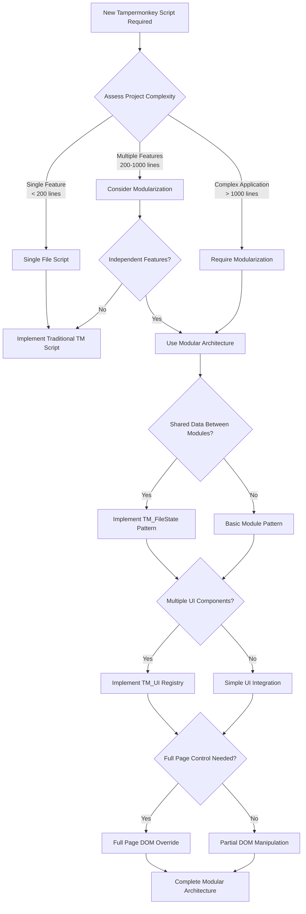
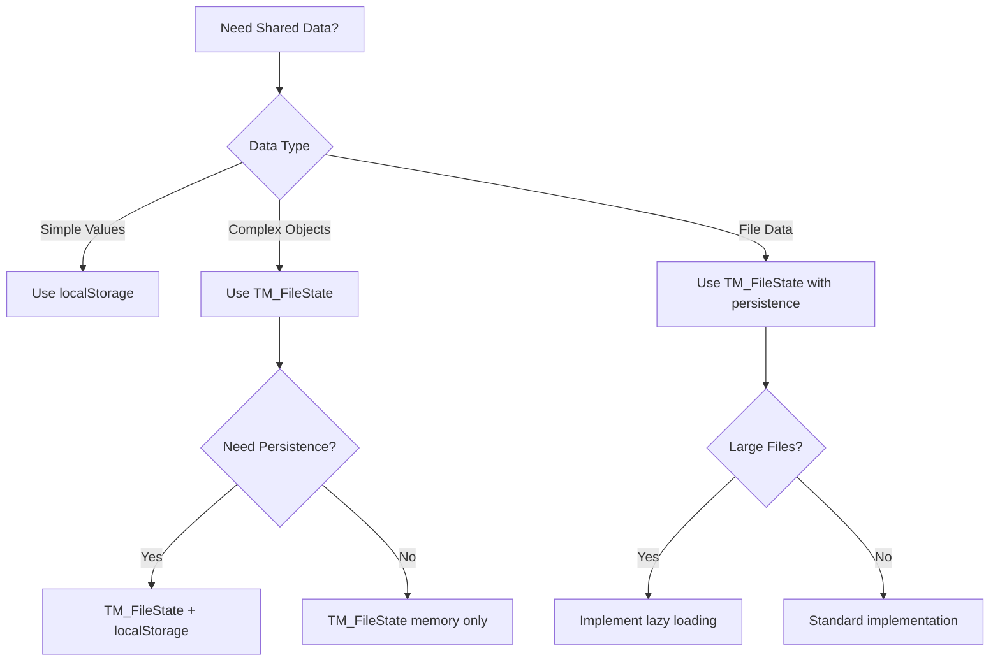
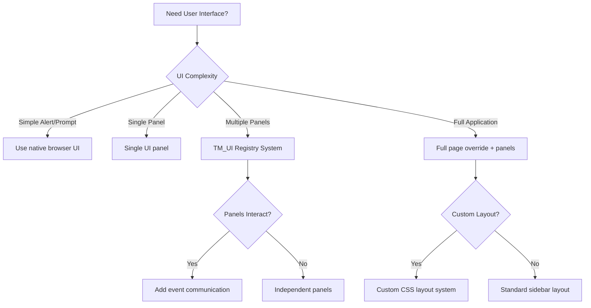
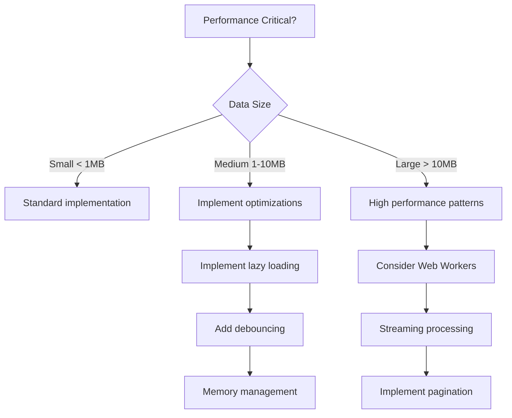

# AI Decision Tree for Modularization Patterns

## Overview for AI Agents

This decision tree provides systematic logic for AI agents to determine when and how to apply modular Tampermonkey architecture patterns. Follow this flowchart to make architectural decisions based on project requirements.

## Primary Decision Flow



## Feature-Based Decision Matrix

| Feature Requirement | Single File | Basic Modular | Full Modular |
|---------------------|-------------|---------------|--------------|
| File processing only | ✅ | ❌ | ❌ |
| Multiple tools | ❌ | ✅ | ✅ |
| Shared state | ❌ | ❌ | ✅ |
| Complex UI | ❌ | ❌ | ✅ |
| Plugin architecture | ❌ | ❌ | ✅ |
| Team development | ❌ | ✅ | ✅ |
| Maintainability | ❌ | ✅ | ✅ |

## Architecture Pattern Selection

### Pattern 1: Single File Script
**Use When:**
- Single, focused functionality
- < 200 lines of code
- No shared state requirements
- Simple UI needs

**Implementation:**
```javascript
// ==UserScript==
// @name         Simple Tool
// @match        https://example.com/*
// @grant        none
// ==/UserScript==

(function() {
    'use strict';
    // All functionality in one file
})();
```

### Pattern 2: Basic Modular
**Use When:**
- 2-4 independent features
- 200-1000 lines total
- Minimal shared state
- Team development benefits

**Implementation:**
```javascript
// ==UserScript==
// @name         Modular Tool
// @require      https://github.com/user/repo/raw/main/module1.js
// @require      https://github.com/user/repo/raw/main/module2.js
// @match        https://example.com/*
// @grant        none
// ==/UserScript==

(function() {
    'use strict';
    // Basic orchestration
})();
```

### Pattern 3: Full Modular Architecture
**Use When:**
- > 5 features or > 1000 lines
- Complex shared state
- Multiple UI components
- Plugin-like architecture
- Long-term maintenance

**Implementation:**
```javascript
// ==UserScript==
// @name         Complex Modular App
// @require      https://cdnjs.cloudflare.com/ajax/libs/xlsx/0.17.0/xlsx.full.min.js
// @require      https://github.com/user/repo/raw/main/uiSystem.js
// @require      https://github.com/user/repo/raw/main/stateManager.js
// @require      https://github.com/user/repo/raw/main/module1.js
// @require      https://github.com/user/repo/raw/main/module2.js
// @match        https://example.com/*
// @grant        none
// ==/UserScript==
```

## Component Decision Trees

### State Management Decision


### UI Architecture Decision


### Performance Decision Tree


## AI Agent Decision Algorithm

```javascript
// AI agents can use this algorithm for systematic decisions
function determineArchitecture(requirements) {
    const analysis = {
        complexity: assessComplexity(requirements),
        features: countFeatures(requirements),
        sharedState: needsSharedState(requirements),
        uiComplexity: assessUIComplexity(requirements),
        performance: assessPerformanceNeeds(requirements)
    };
    
    // Apply decision tree logic
    if (analysis.complexity === 'simple' && analysis.features <= 1) {
        return 'single-file';
    }
    
    if (analysis.features <= 4 && !analysis.sharedState) {
        return 'basic-modular';
    }
    
    if (analysis.sharedState || analysis.uiComplexity === 'high' || analysis.features > 4) {
        return 'full-modular';
    }
    
    return 'basic-modular'; // Default fallback
}

function assessComplexity(requirements) {
    const indicators = [
        requirements.linesOfCode > 1000,
        requirements.multipleDataSources,
        requirements.complexBusinessLogic,
        requirements.userManagement,
        requirements.persistentState
    ];
    
    const complexityScore = indicators.filter(Boolean).length;
    
    if (complexityScore >= 3) return 'complex';
    if (complexityScore >= 1) return 'moderate';
    return 'simple';
}

function needsSharedState(requirements) {
    return requirements.multipleModules && (
        requirements.sharedData ||
        requirements.fileProcessing ||
        requirements.userPreferences ||
        requirements.crossModuleCommunication
    );
}
```

## Implementation Sequence Decision

### Phase 1: Foundation


### Phase 2: Module Development


### Phase 3: Optimization


## Validation Checkpoints

### Architecture Validation
- [ ] Architecture matches complexity requirements
- [ ] All required patterns are implemented
- [ ] No over-engineering for simple requirements
- [ ] Performance requirements are met
- [ ] Maintainability goals are achieved

### Pattern Validation
- [ ] @require dependencies are properly ordered
- [ ] State management is appropriate for data complexity
- [ ] UI architecture matches interaction requirements
- [ ] Event communication is properly implemented
- [ ] Error handling covers all failure modes

## Common Decision Mistakes to Avoid

1. **Over-Engineering**: Using full modular architecture for simple scripts
2. **Under-Engineering**: Using single file for complex multi-feature applications
3. **Premature Optimization**: Adding performance patterns before they're needed
4. **State Complexity**: Using complex state management for simple data
5. **UI Overkill**: Full page override when simple panels suffice

## Decision Documentation Template

```markdown
## Architecture Decision Record

**Decision**: [Chosen architecture pattern]
**Date**: [Decision date]
**Status**: [Proposed/Accepted/Deprecated]

### Context
- Project requirements: [List key requirements]
- Complexity assessment: [Simple/Moderate/Complex]
- Team size: [Number of developers]
- Maintenance timeline: [Expected lifespan]

### Decision Factors
- Lines of code estimate: [Number]
- Number of features: [Count]
- Shared state requirements: [Yes/No + details]
- UI complexity: [Low/Medium/High]
- Performance requirements: [Details]

### Chosen Architecture
- Pattern: [Single File/Basic Modular/Full Modular]
- State management: [None/localStorage/TM_FileState]
- UI system: [Native/Basic/TM_UI Registry]
- DOM strategy: [Partial/Full Override]

### Rationale
[Explanation of why this architecture was chosen]

### Consequences
- Benefits: [List advantages]
- Drawbacks: [List disadvantages]
- Risks: [Potential issues]
```

This decision tree enables AI agents to make systematic, well-reasoned architectural choices based on project requirements and constraints.