# Module Interaction Flow Diagrams

## Overview for AI Agents

These diagrams show how modules interact in the Excel Quick Tools WFM architecture. AI agents can use these patterns to understand communication flows and implement similar architectures.

## Core System Architecture

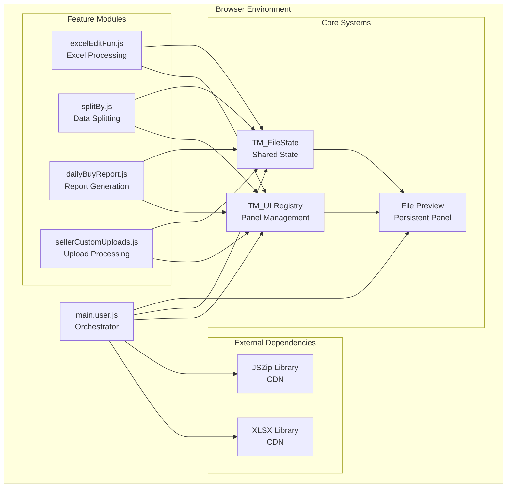

## Module Initialization Flow

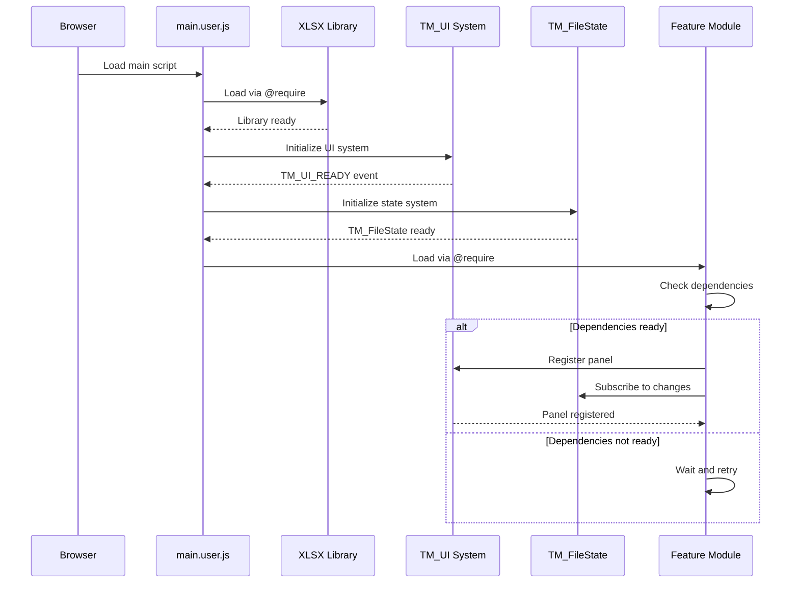

## File Processing Flow

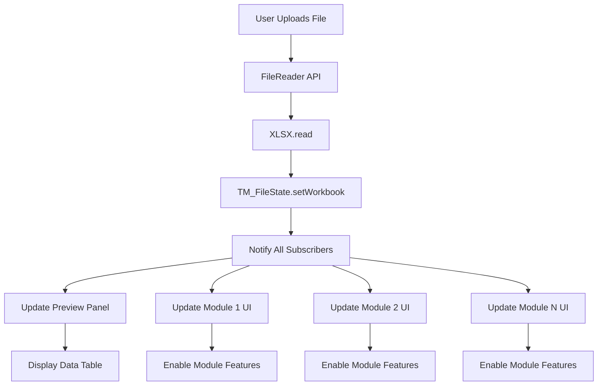

## State Management Communication

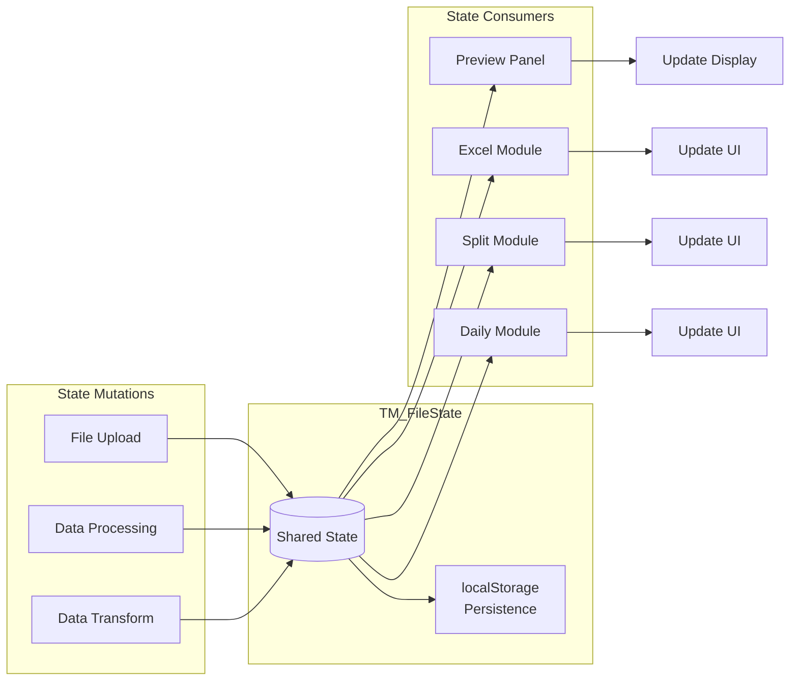

## UI Panel Registration Flow

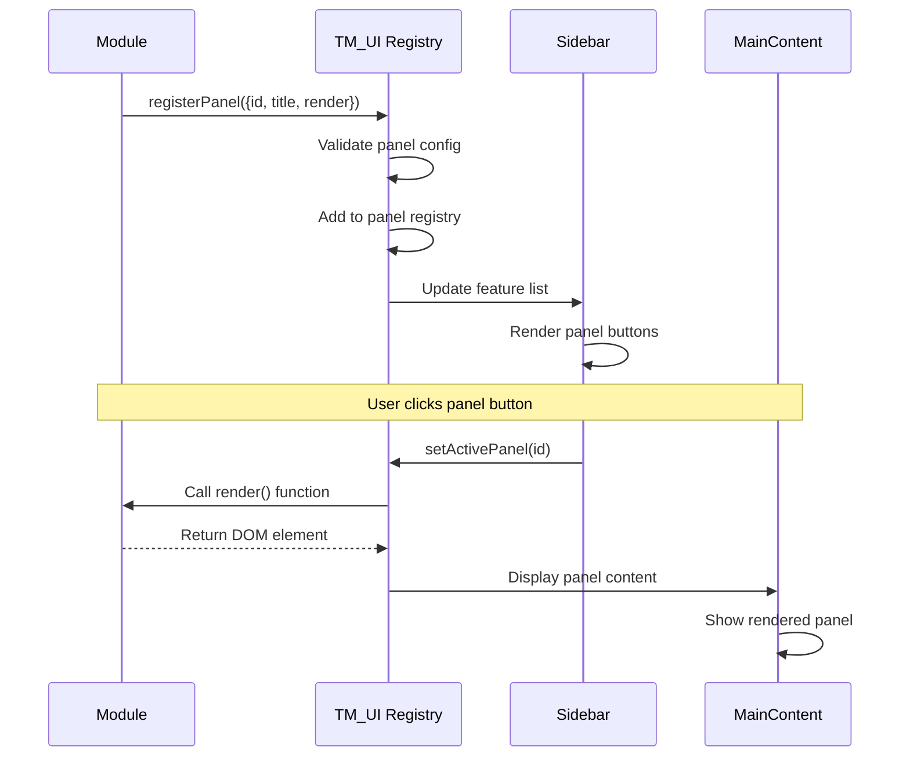

## Event-Driven Communication

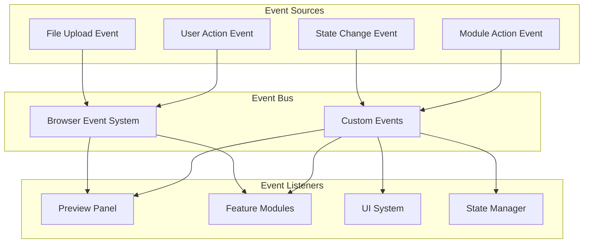

## Data Flow Patterns

### Pattern 1: File Upload to Processing
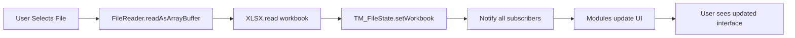

### Pattern 2: Module Processing to Output
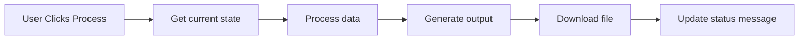

### Pattern 3: Cross-Module Communication
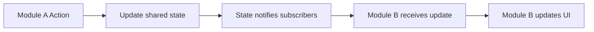

## Error Handling Flow

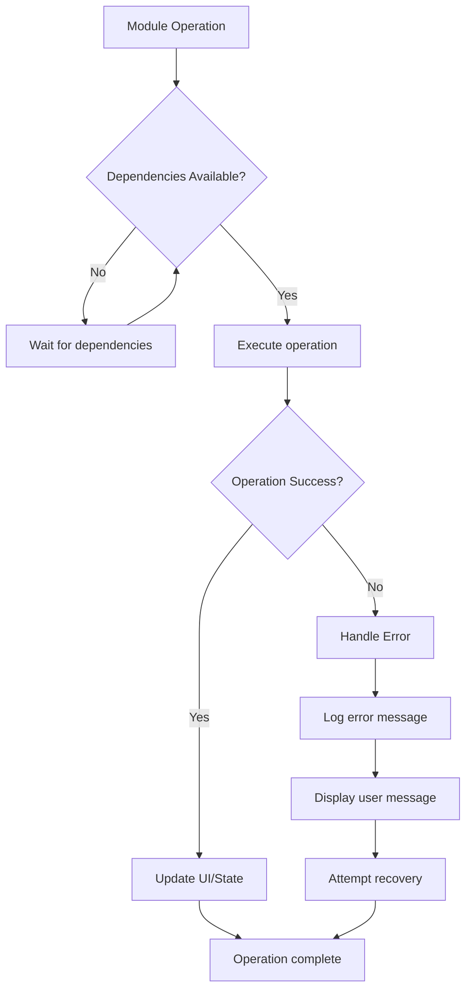

## Memory Management Flow

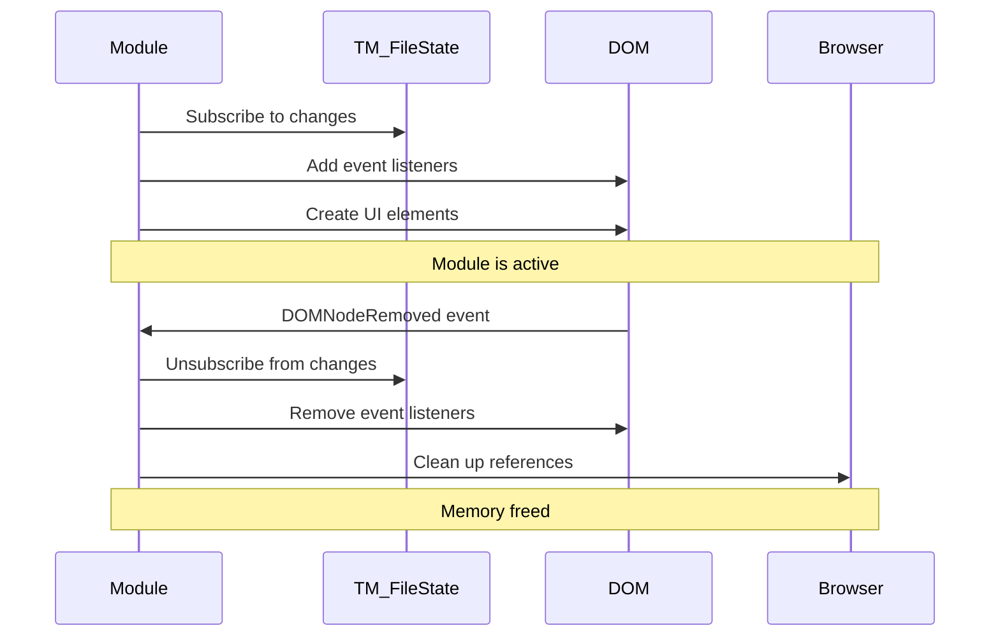

## Performance Optimization Flow

```mermaid
graph TB
    subgraph "Data Loading"
        Large[Large File Detected] --> Lazy[Lazy Loading Strategy]
        Lazy --> Preview[Preview First 30 Rows]
        Preview --> Background[Load Full Data in Background]
    end
    
    subgraph "UI Updates"
        Frequent[Frequent Updates] --> Debounce[Debounce Updates]
        Debounce --> Batch[Batch DOM Changes]
        Batch --> RAF[Use requestAnimationFrame]
    end
    
    subgraph "Memory Management"
        Heavy[Heavy Operations] --> Worker[Consider Web Workers]
        Worker --> Cleanup[Aggressive Cleanup]
        Cleanup --> GC[Trigger Garbage Collection]
    end
```

## AI Agent Implementation Guide

### Step 1: Understand the Flow
1. Study the main architecture diagram
2. Identify which modules you need
3. Understand the initialization sequence

### Step 2: Follow the Patterns
1. Use the file processing flow for data handling
2. Follow the UI registration flow for panels
3. Implement state management communication

### Step 3: Handle Edge Cases
1. Follow error handling flow
2. Implement memory management
3. Apply performance optimizations

### Key Takeaways for AI Agents

1. **Dependencies Load First**: Libraries before modules
2. **Wait for Systems**: Check TM_UI and TM_FileState availability
3. **Subscribe and Cleanup**: Always unsubscribe from state changes
4. **Event-Driven**: Use events for loose coupling
5. **Performance Aware**: Implement lazy loading for large data

These diagrams provide AI agents with visual guides for implementing similar modular architectures in their own Tampermonkey scripts.