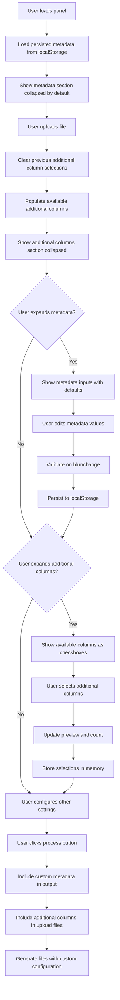

# UI Design Specifications: Editable Metadata & Additional Columns

## Overview

This document provides comprehensive UI design specifications for adding two new features to the Split To Upload Files tool:
1. **Editable Metadata Configuration** - Allow users to customize the 4 hardcoded metadata components
2. **Additional Columns Selection** - Enable users to select extra columns beyond the required ones

## Current Implementation Analysis

### Existing UI Patterns
- **Color Scheme**: Primary green `#004E36`, white backgrounds, light gray borders `#ccc`
- **Typography**: 15px inputs, 16px buttons, 14px status text
- **Layout**: Full-width inputs with 10px margins, 7px padding
- **Interaction**: Disabled states with opacity 0.5, hover transitions
- **Integration Point**: Between column dropdown (line 185) and suffix input (line 187)

### Current Metadata (Lines 429-434)
```javascript
const metadataLine = [
  "TemplateType=fptcustom",
  "Version=2025.0401", 
  "TemplateSignature=Rk9PRA==",
  "settings=attributeRow=3&contentLanguageTag=en_US&dataRow=4&feedType=113&headerLanguageTag=en_US&isEdit=false&isProcessingSummary=false&labelRow=2&metadataVersion=MatprodVm9MVFByb2RfMTIzNA%3D%3D&primaryMarketplaceId=amzn1.mp.o.ATVPDKIKX0DER&ptds=Rk9PRA%3D%3D&reportProvenance=false&templateIdentifier=5dd18c07-9366-4278-8b7c-ed2710400e03&timestamp=2025-04-01T13%3A22%3A35.302Z"
];
```

## 1. Metadata Configuration Section Design

### Visual Design
```html
<!-- Collapsible Metadata Configuration Section -->
<div id="split-to-upload-metadata-section" style="margin-bottom: 12px;">
  <div id="split-to-upload-metadata-header" style="display: flex; align-items: center; cursor: pointer; padding: 8px 0; border-bottom: 1px solid #e0e0e0;">
    <span id="split-to-upload-metadata-toggle" style="margin-right: 8px; font-size: 14px; color: #004E36; transition: transform 0.2s;">▼</span>
    <label style="margin: 0; font-weight: 500; flex: 1; cursor: pointer;">Metadata Configuration</label>
    <span style="font-size: 12px; color: #666;">Click to expand</span>
  </div>
  
  <div id="split-to-upload-metadata-content" style="padding: 12px 0; display: none;">
    <div style="background: #f8f9fa; padding: 12px; border-radius: 5px; margin-bottom: 12px; font-size: 13px; color: #666;">
      <strong>Info:</strong> These values control the metadata line in generated upload files. Defaults are provided but can be customized as needed.
    </div>
    
    <label for="split-to-upload-template-type">Template Type</label>
    <input type="text" id="split-to-upload-template-type" value="TemplateType=fptcustom" placeholder="TemplateType=fptcustom" />
    
    <label for="split-to-upload-version">Version</label>
    <input type="text" id="split-to-upload-version" value="Version=2025.0401" placeholder="Version=2025.0401" />
    
    <label for="split-to-upload-signature">Template Signature</label>
    <input type="text" id="split-to-upload-signature" value="TemplateSignature=Rk9PRA==" placeholder="TemplateSignature=Rk9PRA==" />
    
    <label for="split-to-upload-settings">Settings</label>
    <textarea id="split-to-upload-settings" rows="3" style="resize: vertical; font-family: monospace; font-size: 13px;" placeholder="settings=attributeRow=3&contentLanguageTag=en_US...">settings=attributeRow=3&contentLanguageTag=en_US&dataRow=4&feedType=113&headerLanguageTag=en_US&isEdit=false&isProcessingSummary=false&labelRow=2&metadataVersion=MatprodVm9MVFByb2RfMTIzNA%3D%3D&primaryMarketplaceId=amzn1.mp.o.ATVPDKIKX0DER&ptds=Rk9PRA%3D%3D&reportProvenance=false&templateIdentifier=5dd18c07-9366-4278-8b7c-ed2710400e03&timestamp=2025-04-01T13%3A22%3A35.302Z</textarea>
    
    <div style="display: flex; gap: 8px; margin-top: 8px;">
      <button type="button" id="split-to-upload-metadata-reset" style="background: #6c757d; flex: 1;">Reset to Defaults</button>
      <button type="button" id="split-to-upload-metadata-validate" style="background: #004E36; flex: 1;">Validate Settings</button>
    </div>
    
    <div id="split-to-upload-metadata-status" style="font-size: 12px; margin-top: 8px; min-height: 16px;"></div>
  </div>
</div>
```

### Styling Additions
```css
#split-to-upload-metadata-section textarea {
  width: 100%;
  margin-bottom: 10px;
  padding: 7px 10px;
  border: 1px solid #ccc;
  border-radius: 5px;
  font-size: 13px;
  line-height: 1.4;
}

#split-to-upload-metadata-header:hover {
  background-color: #f8f9fa;
}

#split-to-upload-metadata-toggle.collapsed {
  transform: rotate(-90deg);
}

.metadata-validation-error {
  color: #dc3545;
  font-weight: 500;
}

.metadata-validation-success {
  color: #28a745;
  font-weight: 500;
}
```

## 2. Additional Columns Selection Design

### Visual Design
```html
<!-- Additional Columns Selection Section -->
<div id="split-to-upload-additional-section" style="margin-bottom: 12px;">
  <div id="split-to-upload-additional-header" style="display: flex; align-items: center; cursor: pointer; padding: 8px 0; border-bottom: 1px solid #e0e0e0;">
    <span id="split-to-upload-additional-toggle" style="margin-right: 8px; font-size: 14px; color: #004E36; transition: transform 0.2s;">▼</span>
    <label style="margin: 0; font-weight: 500; flex: 1; cursor: pointer;">Additional Columns</label>
    <span id="split-to-upload-additional-count" style="font-size: 12px; color: #666;">0 selected</span>
  </div>
  
  <div id="split-to-upload-additional-content" style="padding: 12px 0; display: none;">
    <div style="background: #f8f9fa; padding: 12px; border-radius: 5px; margin-bottom: 12px; font-size: 13px; color: #666;">
      <strong>Info:</strong> Select additional columns to include in upload files beyond the required ones. Additional columns will be labeled as "Additional Column X" in the output.
    </div>
    
    <div id="split-to-upload-additional-columns" style="max-height: 200px; overflow-y: auto; border: 1px solid #e0e0e0; border-radius: 5px; padding: 8px;">
      <!-- Dynamic content populated by JavaScript -->
      <div style="text-align: center; color: #666; padding: 20px;">
        No additional columns available. Upload a file to see available columns.
      </div>
    </div>
    
    <div style="display: flex; gap: 8px; margin-top: 8px;">
      <button type="button" id="split-to-upload-additional-select-all" style="background: #6c757d; flex: 1;" disabled>Select All</button>
      <button type="button" id="split-to-upload-additional-clear-all" style="background: #6c757d; flex: 1;" disabled>Clear All</button>
    </div>
    
    <div id="split-to-upload-additional-preview" style="margin-top: 12px; display: none;">
      <div style="font-weight: 500; margin-bottom: 8px;">Preview of Additional Columns in Output:</div>
      <div id="split-to-upload-additional-preview-content" style="background: #f8f9fa; padding: 8px; border-radius: 5px; font-size: 12px; font-family: monospace;"></div>
    </div>
  </div>
</div>
```

### Dynamic Column Checkbox Template
```html
<!-- Template for each additional column checkbox -->
<div class="additional-column-item" style="display: flex; align-items: center; padding: 6px 8px; border-bottom: 1px solid #f0f0f0;">
  <input type="checkbox" id="additional-col-{columnName}" value="{columnName}" style="margin-right: 8px;">
  <label for="additional-col-{columnName}" style="flex: 1; margin: 0; cursor: pointer; font-size: 14px;">
    <span class="column-name" style="font-weight: 500;">{columnName}</span>
    <span class="column-label" style="color: #666; font-size: 12px; margin-left: 8px;">→ Additional Column {index}</span>
  </label>
</div>
```

## 3. Integration Specifications

### HTML Integration Point
The new sections will be inserted between the column dropdown and suffix input:

```html
<!-- Existing: Column dropdown (line 185) -->
<select id="split-to-upload-column">...</select>

<!-- NEW: Metadata Configuration Section -->
<div id="split-to-upload-metadata-section">...</div>

<!-- NEW: Additional Columns Selection Section -->  
<div id="split-to-upload-additional-section">...</div>

<!-- Existing: Suffix input (line 187) -->
<input type="text" id="split-to-upload-suffix" value="upload" />
```

### CSS Integration
New styles will be added to the existing `#split-to-upload-style` block to maintain consistency.

## 4. User Interaction Flow



## 5. State Management Requirements

### Metadata Persistence
```javascript
// localStorage key for metadata persistence
const METADATA_STORAGE_KEY = "splitToUploadFiles_metadata";

// Default metadata structure
const DEFAULT_METADATA = {
  templateType: "TemplateType=fptcustom",
  version: "Version=2025.0401", 
  signature: "TemplateSignature=Rk9PRA==",
  settings: "settings=attributeRow=3&contentLanguageTag=en_US&dataRow=4&feedType=113&headerLanguageTag=en_US&isEdit=false&isProcessingSummary=false&labelRow=2&metadataVersion=MatprodVm9MVFByb2RfMTIzNA%3D%3D&primaryMarketplaceId=amzn1.mp.o.ATVPDKIKX0DER&ptds=Rk9PRA%3D%3D&reportProvenance=false&templateIdentifier=5dd18c07-9366-4278-8b7c-ed2710400e03&timestamp=2025-04-01T13%3A22%3A35.302Z"
};
```

### Additional Columns State
```javascript
// In-memory state for additional columns (cleared on file upload)
let additionalColumnsState = {
  availableColumns: [], // All non-required columns from uploaded file
  selectedColumns: [],  // User-selected additional columns
  requiredColumns: [    // Existing required columns (unchanged)
    "feed_product_type", "item_sku", "update_delete", "standard_price",
    "offering_start_date", "offering_end_date", "condition_type", 
    "main_image_url", "external_product_id", "external_product_id_type", "quantity"
  ]
};
```

## 6. Technical Implementation Specifications

### Metadata Configuration Functions
```javascript
// Load persisted metadata or defaults
function loadMetadataConfig() {
  try {
    const saved = localStorage.getItem(METADATA_STORAGE_KEY);
    return saved ? JSON.parse(saved) : DEFAULT_METADATA;
  } catch (e) {
    return DEFAULT_METADATA;
  }
}

// Save metadata to localStorage
function saveMetadataConfig(metadata) {
  try {
    localStorage.setItem(METADATA_STORAGE_KEY, JSON.stringify(metadata));
  } catch (e) {
    console.warn('Failed to save metadata configuration');
  }
}

// Validate metadata format
function validateMetadata(metadata) {
  const errors = [];
  if (!metadata.templateType.startsWith('TemplateType=')) {
    errors.push('Template Type must start with "TemplateType="');
  }
  if (!metadata.version.startsWith('Version=')) {
    errors.push('Version must start with "Version="');
  }
  // Additional validation rules...
  return errors;
}
```

### Additional Columns Functions
```javascript
// Update available additional columns when file changes
function updateAdditionalColumns(fileColumns) {
  const required = additionalColumnsState.requiredColumns;
  const available = fileColumns.filter(col => 
    !required.includes(col) && col !== 'alternate_tax_code'
  );
  
  additionalColumnsState.availableColumns = available;
  additionalColumnsState.selectedColumns = []; // Clear selections
  
  renderAdditionalColumnsUI();
}

// Generate additional column labels and keys
function generateAdditionalColumnMapping(selectedColumns) {
  return selectedColumns.map((col, index) => ({
    originalName: col,
    displayLabel: `Additional Column ${index + 1}`,
    systemKey: col // Use actual header name as system key
  }));
}
```

## 7. Responsive Design Considerations

### Mobile/Tablet Adaptations
- Collapsible sections prevent UI clutter on smaller screens
- Textarea in metadata section uses responsive height
- Additional columns list has max-height with scroll for long lists
- Button groups stack vertically on narrow screens

### Accessibility Features
- Proper ARIA labels for all interactive elements
- Keyboard navigation support for collapsible sections
- Screen reader friendly descriptions
- High contrast maintained for all text elements
- Focus indicators for all interactive elements

## 8. Validation and Error Handling

### Metadata Validation
- Real-time validation on input blur
- Visual feedback with error/success states
- Specific error messages for common issues
- Reset to defaults option for recovery

### Additional Columns Validation
- Prevent selection of required columns (disabled state)
- Handle edge cases with no additional columns available
- Clear feedback when selections change
- Preview updates in real-time

### Error States
```css
.validation-error {
  border-color: #dc3545 !important;
  background-color: #fff5f5;
}

.validation-success {
  border-color: #28a745 !important;
  background-color: #f8fff8;
}
```

## 9. Performance Considerations

### Efficient Rendering
- Use document fragments for dynamic column lists
- Debounce validation functions to prevent excessive calls
- Lazy load preview content only when section is expanded
- Minimize DOM manipulations during file processing

### Memory Management
- Clear additional columns state on file upload
- Remove event listeners when sections are collapsed
- Use efficient data structures for column mapping

## 10. Implementation Priority

### Phase 1: Core Functionality
1. Metadata configuration section with persistence
2. Basic additional columns selection
3. Integration with existing file processing

### Phase 2: Enhanced UX
1. Collapsible sections with animations
2. Real-time preview functionality
3. Advanced validation and error handling

### Phase 3: Polish
1. Accessibility improvements
2. Mobile responsiveness
3. Performance optimizations

This specification provides a comprehensive foundation for implementing both the editable metadata configuration and additional columns selection features while maintaining consistency with the existing UI patterns and user experience.